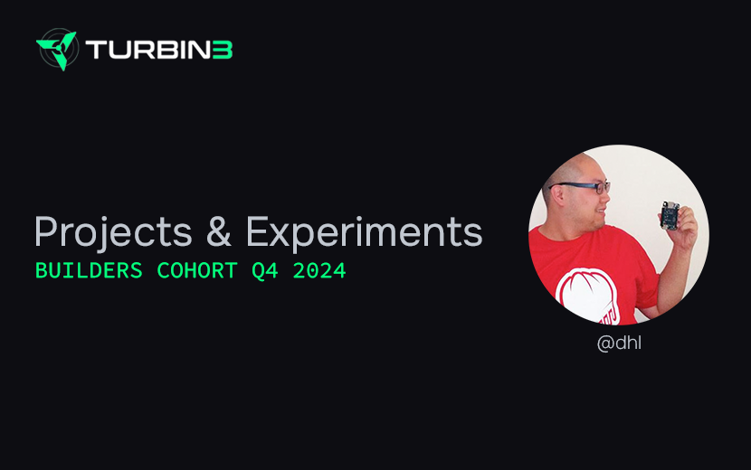

## Saipher — Turbin3 Capstone Project

Saipher is an adaptive governance framework that adjusts a protocol's governance policy on-the-fly based on real-time
conditions of a protocol under its care. The goal is to build a modular, extensible, and upgradeable governance to
make it easier for a protocol to scale its governance to its growing needs.

### Current Status

The project is being developed as a Proof-of-Concept by extending the Solana Program Library (SPL) Governance program
through a plugin program that showcases the feasibility of the concept.

### Testing

A special test runner is provided to run the tests for the Saipher SPL Governance Plugin. This is needed to work around
[a bug](https://github.com/anza-xyz/agave/pull/3692) in `solana-test-validator` for upgradeable genesis programs.

> [!IMPORTANT]
> [tmux](https://github.com/tmux/tmux) is needed to run the test runner.

> [!WARNING]  
> Make sure your Solana CLI is connected to the local cluster (localhost) before running the test runner.

```shell
./tests/run-tests.sh
```

### Source

The SPL Governance Plugin Proof-of-Concept is in [saipher/programs/conditional-plugin](./saipher/programs/conditional-plugin).

### Deployment

Devnet Deployment: [7uRFnRte9TRyEdB2wzStZeA4ZrWei1tGrCNF7zcvwC1Z](https://explorer.solana.com/address/7uRFnRte9TRyEdB2wzStZeA4ZrWei1tGrCNF7zcvwC1Z?cluster=devnet)

## Other Selected Crypto/Web3 Projects

## blake2b-solidity

[blake2b-solidity](https://github.com/dhl/blake2b-solidity/) is a high-performance Solidity implementation of the
BLAKE2b hash function for the Ethereum Virtual Machine (EVM). It is currently the cheapest and fastest implementation of
BLAKE2b for the EVM, using only 14% more gas than the native Keccak-256 hash function. It is also the only
blake2b-solidity implementation that implements all the commonly used extensions of the BLAKE2b hash function, including
the ability to specify personalization hash, salting, and keying.

### L2X Protocol

[L2X](https://github.com/OAXFoundation/l2x-trustless-exchange/blob/master/docs/l2x-specification.pdf) is a high
performance, trustless exchange protocol that enables the creation of decentralized exchanges (DEXs) with the same
performance as centralized exchanges (CEXs). It is a very early app-specific, optimistic rollup design.
